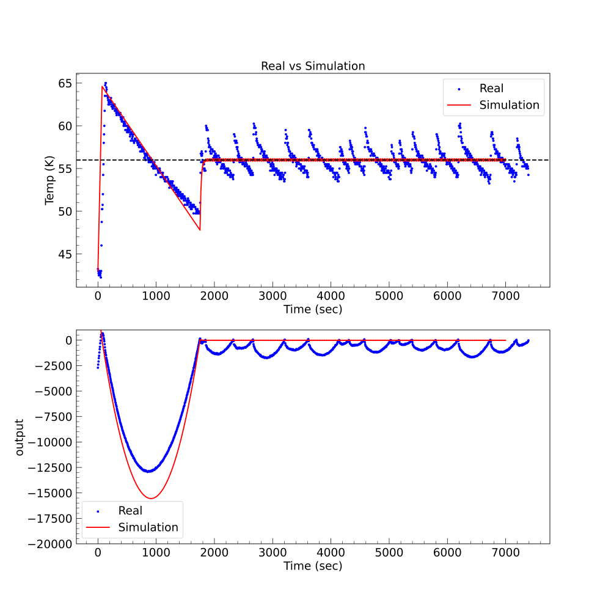

# pidML - Genetic-algorithm-trained PID controller


In "pidML", "pid" stands for a PID temperature controller. This temperature controller is to help me repurpose my old electric kettle into a "mini" Sous vide cooker. This kettle has a small volume of 1 liter, easy to reach stable and uniform temperature even without external water cycle, which is necessary in a much larger, commercial cooker. On the other hand, "ML" stands for machine learning, which I tried to implement genetic algorithm to help training PID parameters.

## List of components
| Functional parts   | Models             |
|--------------------|--------------------|
| Microprocessor     | Raspberry Pi Pico  |
| Temperature sensor | MAX6675            |
| 220V control       | Relay              |
| User interface     | ICD 1602           |
|User input|rotary potentiometer|
 
## Implementation
git clone this repo, and use pidtrain.py to train PID parameters, then input them into the micropython codes under 
```mpython/main.py```. Copy this file and its library ```lib``` onto your microprocessor (Pi Pico, Arduino or ESP32).
Wire hardware as below:


## Develop upon the simplest idea
Idea0: 
```python
if measured temperature < the set temperature:
	turn on the heater (relay) 
else:
	turn off the heater (relay)
```
Straightforward, but won't work...


Idea1:
```python
Kp, Ki, Kd = x, x, x
error = measured temperature - set temperature
integral = error + integral
derivative = (lasterror-error)/dt
output = Kp*error+Ki*integral+Kd*derivative
if output > 0:
	turn on the heater (relay)
else:
	turn off the heater (relay)
```
The PID system instead of temperature will indicate the ON/OFF status of the heater. However, we need to manually set the PID parameters Kp, Ki, Kd. Not cool. 


Idea2:
```
Genetic Algorithm to find the best Kp, Ki, Kd -> PID system
```
The genetic algorithm needs data to train itself. One way is to use practical data, meaning trying out as many as possible PID parameters then feed the experimental data to the algorithm. However, this is tedious and time-consuming. Here we can first build a physical model to predict what will happen according to the law of physics.

Idea3:
```
Physical model to virtually realize the scene 

-> genetic algorithm to find the best Kp, Ki, Kd 

-> PID system
```
## Physical modeling
Heat transfer can take place in four different ways : [Advection, thermal conduction, convection and radiation](https://en.wikipedia.org/wiki/Heat_transfer). Here we only consider thermal conduction and ignore the rest. We also ignore the metal piece (kettle) between hot water and air around, and ideally think the hot water directly interfaces the cold air.

According to Fourier's law: **heater transfer**/meter^2/sec = - **thermal conductivity** * **gradient of temperature** ~ 540 W/meter^2. The surface of the kettle is about 700 cm^2. Then the heater dissipation 
power is thus 37.8 W. The thermal conductivity of air is about [**27 mW/m K**](https://www.engineeringtoolbox.com/air-properties-viscosity-conductivity-heat-capacity-d_1509.html). The power of the heater is 1000 W according to manufacturer. Here is my sketch to illustrate the idea
and some necessary math:


By knowing the heat capacity of water is [**4.184 Joule/gram/deg**](https://www.engineeringtoolbox.com/specific-heat-capacity-water-d_660.html) and 0.8L (800 gram) water inside, we can calculate
the temperature goes up at a rate of **0.3 deg/sec** when the heater is on, and decreases at a rate of 
**0.012 deg/sec** when the heater is off. So far, we have finished the physical modeling part.


## PID controller and genetic algorithm
In a PID controller, the temperature changes according to the results of physical modelling: goes up 0.32 deg/cycle and decrease 0.008 deg/cycle. We can set a cycle to be 1 sec. But 1 sec is meaningless here, since we can set the cycle time to much shorter to run more cycles within a certain time (It is like condensing 1 sec into 0.001 sec, taking full advantage of modelling!). Don't forget to correct this in the calculation of Kd. 

To evaluate each PID, we need to define a cost function L_mae= sum(abs(set temp - measured temp)) or L_mse=sum((set temp - measured temp)^2). At each generation, 
we choose the PID with the smallest cost function to be passed onto the next generation (Elitism) 
and the one with the largest cost function to mutate (mutation, randomize Kp, Ki, Kd),
the rest hybridize with neighboring to produce the next generation (hybrid).
The implementation in codes is as belows:
```python
def pid_hybrid(pid1, pid2):
    dice = rand() * 3
    if 0 <= dice < 1:
        pid1_new = np.array([pid1[0], pid2[1], pid2[2]])
        pid2_new = np.array([pid2[0], pid1[1], pid1[2]])
    elif 1 <= dice < 2:
        pid1_new = np.array([pid2[0], pid1[1], pid2[2]])
        pid2_new = np.array([pid1[0], pid2[1], pid1[2]])
    else:
        pid1_new = np.array([pid2[0], pid2[1], pid1[2]])
        pid2_new = np.array([pid1[0], pid1[1], pid2[2]])
    return pid1_new, pid2_new

def pid_mutation():
    return 100 * random_sample(3)

```


In the 99th generation, we find the winners' descendants start to collapse at a smaller region
in (Kp, Ki, Kd) space. This is a direct consequence of data(model) training.


## Practical experiments and its comparison with our prediction by modelling.
A set of PID parameter (Kp = 88, Ki = 4.4, Kd = 18) wins in the genetic algorithm modeling (100 generations and 
a population size of 20 in each generation). We thus
input them into our PID controller for practical experiments. Here the set-point is 56 degrees Celsius. As seen,
in the first 2000 seconds, the real (experimental data) case matches well with the simulation results (both trend of temperature
and output of PID system). That means
our physical model gives correct predictions of temperature change rates. After 2000 seconds, the simulation
saturate very fast within 0.32 degree. However, in practice, the temperature continues to increase a bit longer
than simulation. This is not overshooting, but may be due to the fact that the heater is still hotter than 
water and continues to heat water even after powered off. This may be the bottleneck to achieve better performance.
I will try to improve this from both hardware and software approach. To be continued ...



 